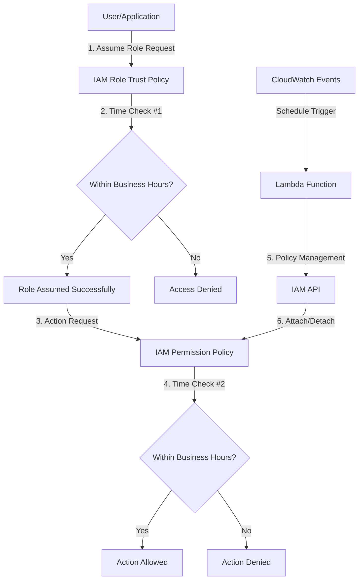

## Technical Architecture description & AWS Best Practices Analysis

### System Overview

The Policy Scheduler implements a time-based access control system using AWS native services orchestrated by Crossplane. It follows a serverless, event-driven architecture that automatically manages IAM policy attachments based on configurable time windows.

### Detailed Component Architecture

#### 1. IAM Role (Core Security Component)

```yaml
apiVersion: iam.aws.upbound.io/v1beta1
kind: Role
spec:
  forProvider:
    assumeRolePolicy: |
      {
        "Version": "2012-10-17",
        "Statement": [
          {
            "Effect": "Allow",
            "Principal": {"Service": "ec2.amazonaws.com"},
            "Action": "sts:AssumeRole"
          },
          {
            "Effect": "Allow",
            "Principal": {"AWS": "arn:aws:iam::*:root"},
            "Action": "sts:AssumeRole",
            "Condition": {
              "DateGreaterThan": {"aws:CurrentTime": "09:00:00Z"},
              "DateLessThan": {"aws:CurrentTime": "17:00:00Z"}
            }
          }
        ]
      }
```

##### Architecture Details:

Trust Policy: Defines who can assume the role and when
Time-Based Conditions: Built into the trust relationship for additional security
Service Integration: Allows both EC2 services and cross-account access
Conditional Logic: Uses AWS native time-based conditions

##### AWS Best Practices Alignment:

- Principle of Least Privilege: Role only assumable during business hours
- Conditional Access: Uses AWS native condition keys for time-based access
- Cross-Account Security: Properly scoped principal definitions
- Service-Based Access: Supports both service and user principals

#### 2. IAM Policy (Permission Boundary)

```yaml
policy: |
  {
    "Version": "2012-10-17",
    "Statement": [
      {
        "Effect": "Allow",
        "Action": ["ec2:*", "s3:*", "rds:*"],
        "Resource": "*",
        "Condition": {
          "DateGreaterThan": {"aws:CurrentTime": "09:00:00Z"},
          "DateLessThan": {"aws:CurrentTime": "17:00:00Z"}
        }
      }
    ]
  }
```

##### Architecture Details:

- Layered Security: Time conditions in both trust policy AND permission policy
- Resource Scoping: Can be configured for specific resources
- Action Granularity: Configurable action lists from read-only to full access
- Defense in Depth: Multiple time checks for redundant security

##### AWS Best Practices Alignment:

- Granular Permissions: Action-level permission control
- Conditional Policies: Uses AWS condition context keys
- Resource-Based Security: Can be scoped to specific resources

#### 3. Lambda Function (Orchestration Engine)

Function Architecture:

```python
def handler(event, context):
    iam = boto3.client('iam')
    
    # Time calculation logic
    utc = tz.gettz('UTC')
    now = datetime.datetime.now(utc)
    current_hour = now.hour
    
    # Function logic
    if start_hour <= current_hour < end_hour:
        # Attach policy during business hours
        iam.attach_role_policy(RoleName=role_name, PolicyArn=policy_arn)
    else:
        # Detach policy outside business hours
        iam.detach_role_policy(RoleName=role_name, PolicyArn=policy_arn)
```

##### Architecture Details:

- Event-Driven: Triggered by CloudWatch Events on schedule
- Stateless Design: No persistent state, derives current state from AWS APIs
- Idempotent Operations: Safe to run multiple times
- Error Handling: Graceful degradation with logging
- Multi-Timezone Support: Handles different timezone calculations

##### AWS Best Practices Alignment:

- Serverless Architecture: No infrastructure to manage
- Event-Driven Design: Responds to CloudWatch Events
- Idempotent Operations: Safe retry mechanisms
- Least Privilege Execution: Lambda role has minimal required permissions
- Observability: CloudWatch Logs integration for monitoring

#### 4. CloudWatch Events (Scheduling Engine)

```yaml
apiVersion: cloudwatchevents.aws.upbound.io/v1beta1
kind: Rule
spec:
  forProvider:
    scheduleExpression: "rate(1 hour)"
    state: "ENABLED"
```

##### Architecture Details:

- Cron-like Scheduling: Configurable intervals from 15 minutes to hours
- Reliable Delivery: AWS managed service with built-in retry
- Event Routing: Targets Lambda function for execution

##### AWS Best Practices Alignment:

- Managed Service: No infrastructure maintenance required
- Reliable Scheduling: Built-in retry and error handling
- Cost Optimization: Pay-per-execution model
- Operational Excellence: Centralized scheduling management

## Security Architecture



### Security Controls Implementation

##### 1. Time-Based Access Controls

- Primary Control: Trust policy time conditions
- Secondary Control: Permission policy time conditions
- Tertiary Control: Lambda-based policy attachment/detachment
- Backup Control: CloudWatch alarms for unauthorized access

##### 2. Principle of Least Privilege

```yaml
# Lambda Execution Role (Minimal Permissions)
PolicyDocument:
  Statement:
    - Effect: Allow
      Action:
        - iam:AttachRolePolicy
        - iam:DetachRolePolicy
        - iam:ListAttachedRolePolicies
      Resource:
        - !Sub "arn:aws:iam::${AWS::AccountId}:role/production-access-*"
        - !Sub "arn:aws:iam::${AWS::AccountId}:policy/production-access-*"
    - Effect: Allow
      Action:
        - logs:CreateLogGroup
        - logs:CreateLogStream
        - logs:PutLogEvents
      Resource: !Sub "arn:aws:logs:${AWS::Region}:${AWS::AccountId}:*"
```

AWS Best Practices Alignment:

- Resource-Specific Permissions: Lambda can only manage specific roles/policies
- Action-Specific Permissions: Only required IAM actions granted
- Logging Permissions: Separate logging permissions for observability

